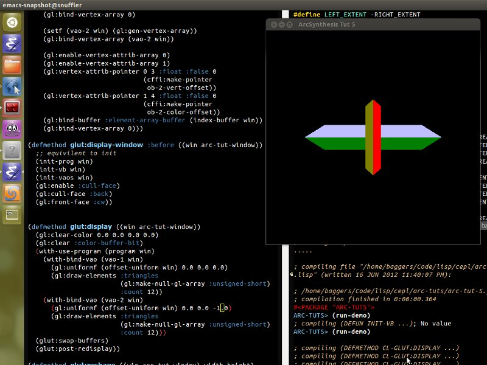

Learning OpenGL in lisp is pretty cool, its my first lisp project, first time using opengl and first time learning the workings of a foriegn function interface. All this makes for hairy debugging as its always nice to learn from some familiar terortory so you have a rough idea, when something goes wrong, whether it's you cocking up or some other bit of code.

This time however, no such luck! But there is progress... I'm up to tutorial 5 in the awesome modern OpenGL tutorials at [ArcSynthesis](http://arcsynthesis.org/gltut/).

